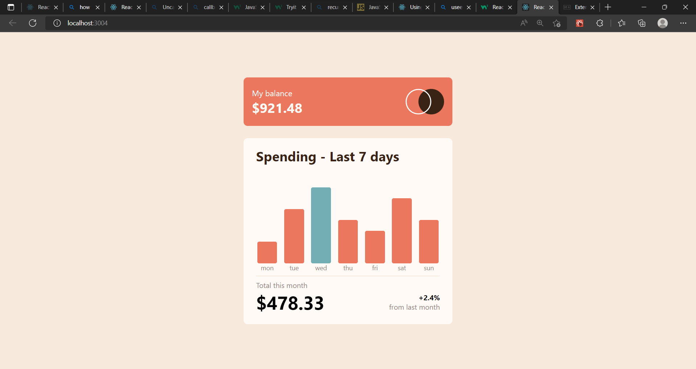

# Frontend Mentor - Expenses chart component solution

This is a solution to the [Expenses chart component challenge on Frontend Mentor](https://www.frontendmentor.io/challenges/expenses-chart-component-e7yJBUdjwt). Frontend Mentor challenges help you improve your coding skills by building realistic projects. 

## Table of contents

- [Overview](#overview)
  - [The challenge](#the-challenge)
  - [Screenshot](#screenshot)
  - [Links](#links)
- [My process](#my-process)
  - [Built with](#built-with)
  - [What I learned](#what-i-learned)
  - [Continued development](#continued-development)
  - [Useful resources](#useful-resources)
- [Author](#author)

## Overview

### The challenge

Users should be able to:

- View the bar chart and hover over the individual bars to see the correct amounts for each day
- See the current day’s bar highlighted in a different colour to the other bars
- View the optimal layout for the content depending on their device’s screen size
- See hover states for all interactive elements on the page
- **Bonus**: Use the JSON data file provided to dynamically size the bars on the chart

### Screenshot



### Links

- Solution URL: [Add solution URL here](https://github.com/adebimpecole/chart-app.git)
- Live Site URL: [Add live site URL here](https://leafy-paprenjak-584ed8.netlify.app/)

## My process

### Built with

- Semantic HTML5 markup
- CSS custom properties
- Flexbox
- Mobile-first workflow
- [React](https://reactjs.org/) - JS library

### What I learned

I learned about Refs and useEffect hooks and its dependenciies.


```js
arr.map((item, index) => {
  if(Number(item)<=val){
      return(
          <div className='sec' style={css} key={index} ref={(element)=>{
              refs.current[index]=element;
          }}>
              {item}
          </div>
      );
  }
})
```

### Continued development
I plan to focus more on my use of refs, the useEffect hook and the useState hook. I also want to continue honing my knowledge of child-to-parent transfer of data.

### Useful resources

- [Example resource 1](https://reactjs.org/docs/refs-and-the-dom.html) - This helped me to select my dom elements with ease. I really liked this pattern and will use it going forward.
- [Example resource 2](https://reactjs.org/docs/hooks-effect.html) - This is an amazing article which helped me finally understand how to use useEffect hooks. I'd recommend it to anyone still learning this concept.

## Author

- Website - [Cole Mary](https://leafy-paprenjak-584ed8.netlify.app/)
- Frontend Mentor - [@adebimpecole](https://www.frontendmentor.io/profile/adebimpecole)
- Twitter - [@adecole02](https://twitter.com/adecole02)

